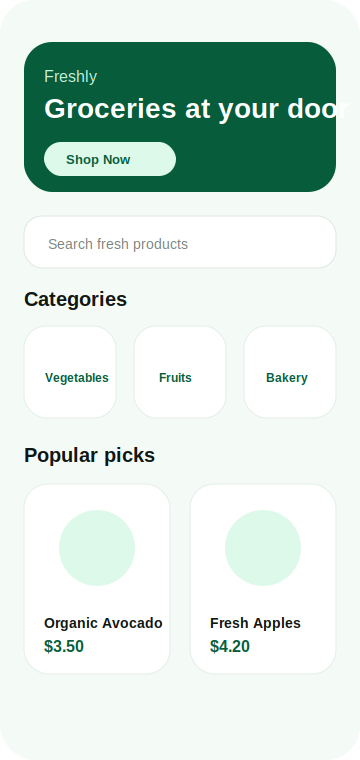
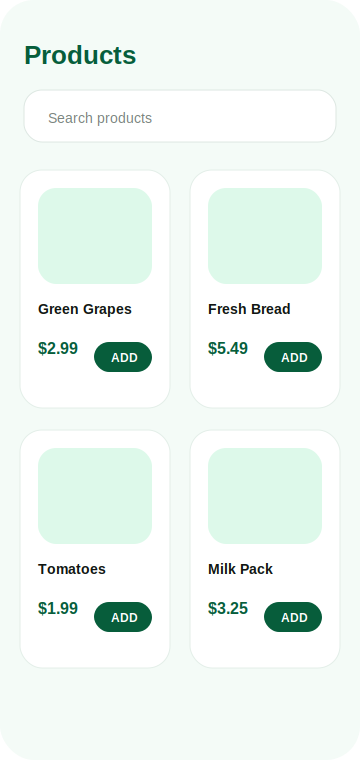
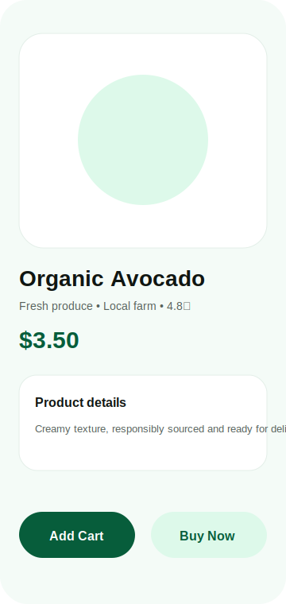
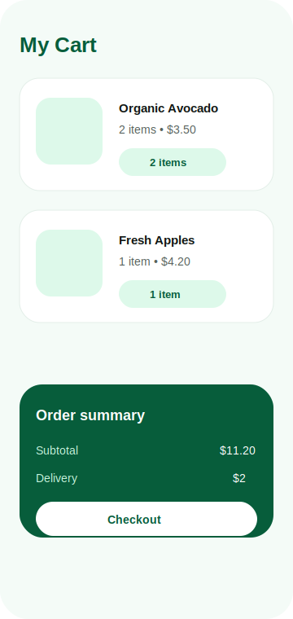
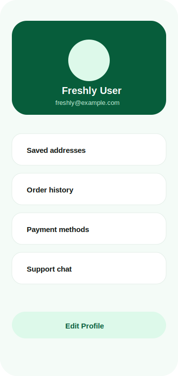

# TheFreshly

TheFreshly is an Android grocery shopping app built with Kotlin. It focuses on a fresh shopping experience with product browsing, cart management, saved locations, checkout, profile management, notifications and support chat.

## ✨ Features

- Fresh grocery dashboard and product discovery
- Product listing, details and category browsing
- Cart quantity controls and checkout flow
- Saved delivery locations with Google Maps support
- User profile, notifications and settings
- Support chat experience
- API integration with local persistence

---

## 📱 Screenshots

> Screenshot assets are stored in [`screenshots/`](./screenshots) and use file names without spaces so GitHub can render them reliably.

<table>
  <tr>
    <td align="center"><strong>Home Screen</strong></td>
    <td align="center"><strong>Product Listing</strong></td>
    <td align="center"><strong>Product Details</strong></td>
  </tr>
  <tr>
    <td></td>
    <td></td>
    <td></td>
  </tr>
  <tr>
    <td align="center"><strong>Cart</strong></td>
    <td align="center"><strong>Profile</strong></td>
    <td align="center"><strong>Freshly UI</strong></td>
  </tr>
  <tr>
    <td></td>
    <td></td>
    <td></td>
  </tr>
</table>

---

## 🏗️ Architecture

This project follows Clean Architecture principles combined with MVVM architecture to keep responsibilities separated and maintainable.

- **Presentation layer**: Fragments, adapters, view models and UI state.
- **Domain layer**: Repository contracts and business models.
- **Data layer**: Remote services, Room database, local entities, mappers and repository implementations.

## 🧰 Tech Stack

- Kotlin
- Android Jetpack
- MVVM
- Hilt dependency injection
- Room database
- Retrofit
- Paging 3
- Coil / Glide image loading
- Google Maps and location services
- Material Components

## 🚀 Getting Started

1. Clone the repository.
2. Open the project in Android Studio.
3. Add required local configuration such as `google-services.json` and Maps/API keys if needed.
4. Sync Gradle.
5. Run the app on an emulator or physical device.

## ✅ Checks

Use the following commands while developing:

```bash
./gradlew assembleDebug
./gradlew test
./gradlew lint
```

## 📄 License

This project is for learning and demonstration purposes.
